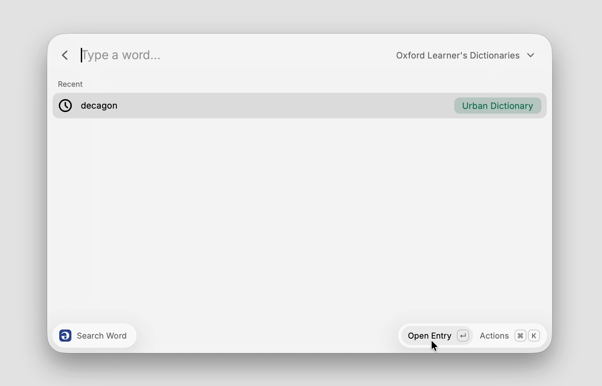

<p align="center">
  
</p>

<h1 align="center">Online English Dictionary</h1>

<p align="center">
  Look up any English word in five dictionaries, hear it said, and get straight back to reading, without leaving your keyboard.
</p>

<p align="center">
  
</p>

## Features

- **Five dictionaries, one window.** Cambridge, Longman, Oxford Learner's, Merriam-Webster and Urban Dictionary, each one ⌘P away from the others.
- **Hear the word.** Enter plays the US recording and ⌘ Enter plays the UK one, on every dictionary that has them.
- **Every sense at a glance.** Noun, verb and each meaning sit in the left column. The full definition, its examples and its picture sit on the right.
- **Define whatever you have selected.** Select a word in any app and run Define Selected Word to land on its entry. With nothing selected it reads the clipboard, but only when it holds a short phrase. Give the command a hotkey in Raycast Settings and the whole loop becomes one keystroke.

## Install

Install from the [Raycast Store](https://www.raycast.com/philly_cai/online-english-dictionary), or run it from source:

```bash
git clone https://github.com/Hephaest/online-english-dictionary.git
cd online-english-dictionary
npm install
npm run dev
```

## Setup

Cambridge, Longman, Oxford Learner's and Urban Dictionary work right away. Merriam-Webster needs a free key:

1. Register at [dictionaryapi.com](https://dictionaryapi.com/register/index) and pick a dictionary. Learner's has IPA transcriptions; Collegiate has the larger word list.
2. Confirm the email, then copy the key from "My Keys".
3. Paste it into the extension preferences and choose the same dictionary under "Merriam-Webster Dictionary".

Until a key is entered, Merriam-Webster stays out of the list.

## Privacy

Lookups run from your own Mac, one page at a time. No dictionary content is stored on disk: the extension keeps only your recent words and your settings, and a pronunciation clip is written to a temporary file that is deleted once it has played.

## Acknowledgements

Thank you to the lexicographers at Cambridge University Press, Pearson Longman, Oxford University Press and Merriam-Webster, and to the Urban Dictionary community. Their work is what makes a word click.

Each dictionary keeps its own terms of use. Please read them before using this extension for anything beyond personal, non-commercial study. The Oxford English Dictionary needs a subscription, so the extension links to its search page rather than showing its content.

## License

[MIT](LICENSE)
